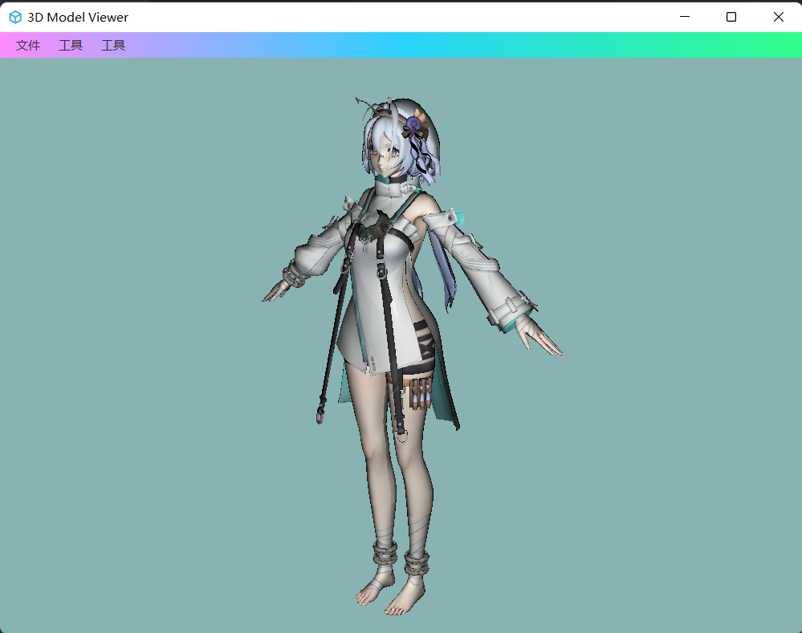

# javafx 3D模型解析器

 	本项目使用了部分来自 [FXyz3D]([FXyz/FXyz: A JavaFX 3D Visualization and Component Library](https://github.com/FXyz/FXyz)) 项目的代码(位于 importers 包下边)，遵循 BSD 3-Clause License。版权归  FXyz3D 及其贡献者所有。在此由衷感谢 FXyz3D 及其贡献者🙏🙏🙏

## 简介

javafx 3D模型解析器（JavaFx Parse 3D Model File）基于javafx解析并显示3D 模型文件，并实现常规的移动旋转等操作。

## 如何构建

本项目基于maven 构建 至少使用 JDK 17 进行构建 在项目根目录下输入

```shell
mvn clean package
```

然后可以在生成的target运行jar包

```shell
java -jar .\target\JavaFxParse3DFile-2.0-SNAPSHOT.jar
```

## 使用

可以直接将obj或者ma等文件直接拖入窗口以显示，或者选择 `文件` -> `导入3D模型文件`.



## 快捷键介绍

`F1` 设置物体自发光

`F2` 线框模式

`shift + w` 放大 

`shift + s`  缩小

`w s a d` 移动

`方向键` 旋转